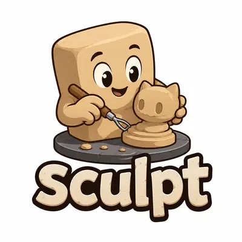

# Sculpt: Modern CLI Framework for Quellabs Ecosystem

A powerful, extensible command-line toolkit that seamlessly integrates with ObjectQuel ORM.

[](https://packagist.org/packages/quellabs/sculpt)
[](LICENSE)
[](https://packagist.org/packages/quellabs/sculpt)

## 🚀 Overview

Sculpt provides an elegant command-line interface for rapid development, code generation, and project management within the Quellabs ecosystem. It's designed to be intuitive for beginners yet powerful enough for advanced use cases.

## ✨ Features

- **Unified Command Interface** — Access commands from across the Quellabs ecosystem through a single CLI tool
- **Service Provider Architecture** — Robust plugin system allowing packages to register commands and services
- **Extensible Design** — Built from the ground up for customization and extension
- **Smart Discovery** — Automatically detects and loads commands from installed packages via Composer
- **Cross-Package Integration** — Enables seamless interaction between ObjectQuel and other components
- **Developer-Friendly** — Colored output, tables, interactive prompts, and per-command help text
- **Parameter Management** — Simple, predictable handling of named parameters, flags, and positional arguments

## 📋 Requirements

- PHP 8.2 or higher
- Composer

## 📦 Installation

```bash
composer require quellabs/sculpt
```

## 🔍 Quick Start

Once installed, Composer creates the `sculpt` binary in your `vendor/bin` directory:

```bash
vendor/bin/sculpt <command>
```

To see all available commands (grouped by namespace):

```bash
vendor/bin/sculpt
```

For detailed help on a specific command:

```bash
vendor/bin/sculpt help <command>
```

## 📖 Documentation

### Core Concepts

Sculpt is built around a few key concepts:

1. **Commands** — The primary way users interact with Sculpt. Each command implements `CommandInterface` (usually via the `CommandBase` abstract class).
2. **Service Providers** — Extend `Quellabs\Sculpt\ServiceProvider` to register one or more commands with the application.
3. **Configuration Manager** — `ConfigurationManager` parses and exposes command-line parameters, flags, and positional arguments to a running command.

### Command Structure

Commands in Sculpt follow a namespace pattern:

```
namespace:command
```

Real examples shipped by packages in this ecosystem:
- `quel:migrate` — Run, roll back, or check the status of database migrations (ObjectQuel)
- `make:entity` — Interactively create or update an entity class (ObjectQuel)
- `make:controller` — Create a new controller class (Canvas)
- `cache:init` — Create the cache configuration file (Canvas)

### Using Command Parameters

`ConfigurationManager` recognizes three kinds of arguments:

```bash
# Named parameters (--name=value or --name value)
vendor/bin/sculpt quel:migrate --target=20240101120000

# Flags (--flag or -f)
vendor/bin/sculpt quel:migrate --force --dry-run

# Short flags (each character is its own flag)
vendor/bin/sculpt quel:migrate -fd

# Positional parameters
vendor/bin/sculpt make:controller User
```

## 🔧 Extending Sculpt

### Creating a Service Provider

Sculpt uses Composer package discovery to find and register service providers from installed packages. A service provider extends `Quellabs\Sculpt\ServiceProvider` and registers one or more commands.

#### 1. Create a Service Provider Class

```php
<?php

namespace Your\Package;

use Quellabs\Sculpt\Application;
use Quellabs\Sculpt\ServiceProvider;

class SculptServiceProvider extends ServiceProvider {

    /**
     * Register your package's commands
     */
    public function register(Application $application): void {
        $this->registerCommands($application, [
            \Your\Package\Commands\YourCommand::class,
            \Your\Package\Commands\AnotherCommand::class,
        ]);
    }
}
```

#### 2. Configure Package Discovery

Sculpt discovers providers through the `extra.discover.sculpt` section of your package's `composer.json`. A single provider:

```json
{
    "name": "your/package",
    "extra": {
        "discover": {
            "sculpt": {
                "provider": "Your\\Package\\SculptServiceProvider"
            }
        }
    }
}
```

Multiple providers, or a provider that ships a config file to publish:

```json
{
    "name": "your/package",
    "extra": {
        "discover": {
            "sculpt": {
                "providers": [
                    {
                        "class": "Your\\Package\\SculptServiceProvider",
                        "config": "config/your-package.php"
                    },
                    "Your\\Package\\AnotherServiceProvider"
                ]
            }
        }
    }
}
```

### Creating Custom Commands

Commands implement `CommandInterface`, normally by extending `Quellabs\Sculpt\Contracts\CommandBase`:

```php
<?php

namespace Your\Package\Commands;

use Quellabs\Sculpt\ConfigurationManager;
use Quellabs\Sculpt\Contracts\CommandBase;

class YourCommand extends CommandBase {

    /**
     * Command signature used to invoke it from the CLI
     */
    public function getSignature(): string {
        return 'your:command';
    }

    /**
     * Short description shown in the command list
     */
    public function getDescription(): string {
        return 'Description of your command';
    }

    /**
     * Detailed help shown by "sculpt help your:command"
     */
    public function getHelp(): string {
        return <<<HELP
USAGE:
    php sculpt your:command [name] [--force]

ARGUMENTS:
    name    Name to operate on (optional)

OPTIONS:
    --force    Skip confirmation prompts
HELP;
    }

    /**
     * Execute the command with parsed configuration
     */
    public function execute(ConfigurationManager $config): int {
        // Positional argument, named parameter, and flag access
        $name = $config->getPositional(0, 'default-name');
        $force = $config->hasFlag('force');

        $this->output->writeLn("<bold>Executing command for: {$name}</bold>");

        if ($force) {
            $this->output->warning('Force flag is enabled!');
        }

        // Command implementation here...
        $this->output->success('Command completed successfully!');

        return 0; // Return 0 for success, non-zero for errors
    }
}
```

### Using the Configuration Manager

The `ConfigurationManager` provides access to the parsed command parameters:

```php
// Get a named parameter with a default value
$name = $config->get('name', 'default-value');
$name = $config->getAsString('name', 'default-value');
$count = $config->getAsInt('limit', 10);

// Check if a named parameter was passed at all
if ($config->has('name')) {
    // ...
}

// Check if a flag is set
if ($config->hasFlag('force') || $config->hasFlag('f')) {
    // Do something forcefully
}

// Get a positional parameter by index
$firstArg = $config->getPositional(0);

// Get everything at once (named, flags, positional)
$all = $config->all();
```

### Console Output

`CommandBase` exposes `$this->output` (`ConsoleOutput`) and `$this->input` (`ConsoleInput`):

```php
// Styled text — tags map to ANSI codes and are stripped automatically
// when output isn't a TTY
$this->output->writeLn('<bold><green>Done!</green></bold>');

// Pre-built message styles
$this->output->success('Everything worked');
$this->output->warning('Proceed with caution');
$this->output->error('Something went wrong');

// Tables
$this->output->table(['Name', 'Type'], [
    ['id', 'integer'],
    ['email', 'string'],
]);

// Interactive prompts
$name = $this->input->ask('What is your name?', 'Anonymous');
$proceed = $this->input->confirm('Continue?', true);
$choice = $this->input->choice('Pick one', ['a', 'b', 'c'], 1);
```

## 🤝 Contributing

Contributions are welcome! Here's how you can help:

1. **Report bugs** — Open an issue if you find a bug
2. **Suggest features** — Have an idea? Share it!
3. **Submit PRs** — Fixed something or added a new feature? Submit a pull request

Please ensure your code adheres to our coding standards and includes appropriate tests.

## 📄 License

Sculpt is open-source software licensed under the MIT license.
